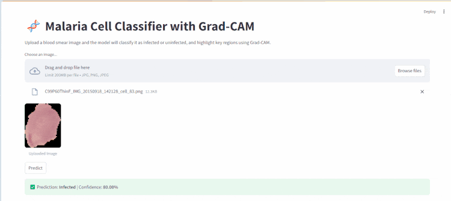

# 🧬 Malaria Cell Classifier with Grad-CAM & Streamlit UI

A deep learning-based malaria detection system using ResNet50 and Grad-CAM explainability.

## 🚀 Features

- ✅ Binary classification of blood smear images (`Infected` / `Uninfected`)
- 🔍 Grad-CAM visualizations to highlight infected regions
- 🌐 Interactive Streamlit web interface
- 📦 Easy-to-deploy structure

## 🛠️ Built With

- [PyTorch](https://pytorch.org/)
- [Streamlit](https://streamlit.io/)
- [Grad-CAM](https://arxiv.org/abs/1610.02391)
- [ResNet50](https://pytorch.org/vision/stable/models.html)

## 📦 Dataset

Uses the [Malaria Cell Images Dataset](https://www.kaggle.com/iarunava/cell-images-for-detecting-malaria)

## 📁 Folder Structure

Place raw images in:
data/cell_images/
├── Parasitized/
└── Uninfected/

## Here's a quick preview of the app in action:



## 🧪 Usage

## 🛠️ Requirements

Install dependencies:

```bash
pip install torch torchvision streamlit opencv-python matplotlib scikit-learn
```
